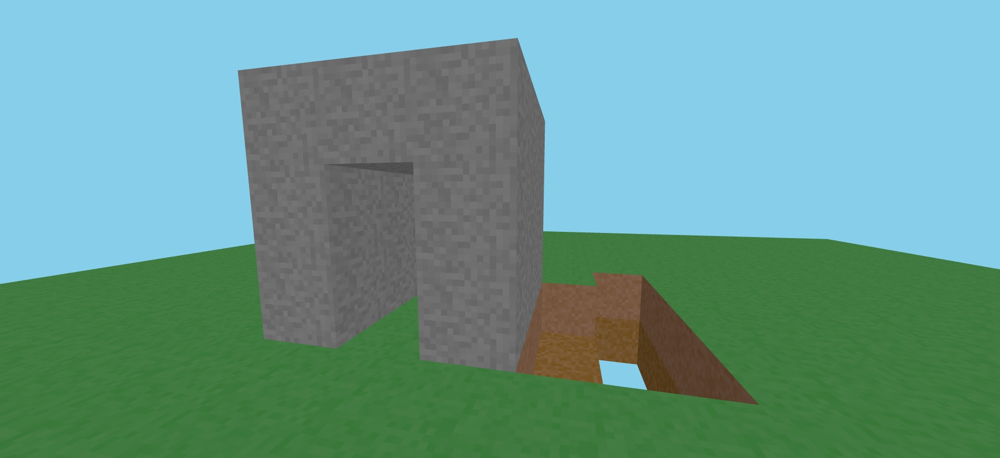

# Minecraft Clone with Three.js

A browser-based Minecraft-inspired voxel game built using Three.js.



## Features

- **Procedurally Generated Textures**: Simple but effective textures for dirt, grass, and stone blocks.
- **Block Interaction**: Place and break blocks in a Minecraft-style world.
- **Physics**: Player movement with gravity and jumping capabilities.
- **First-Person Controls**: Navigate the world from a first-person perspective.

## Installation

1. Make sure you have [Node.js](https://nodejs.org/) installed.
2. Clone this repository:
   ```
   git clone <repository-url>
   cd minecraft-clone
   ```
3. Install dependencies:
   ```
   npm install
   ```

## Running the Game

Start the development server:

```
npm run dev
```

Then open your browser and navigate to the URL shown in the terminal (typically http://localhost:5173/).

## How to Play

### Controls

- **Mouse**: Look around
- **W**: Move forward
- **A**: Move left
- **S**: Move backward
- **D**: Move right
- **Spacebar**: Jump
- **Left Click**: Break block
- **Right Click**: Place block (stone)
- **Escape**: Release mouse cursor

### Gameplay

1. Click anywhere on the screen to lock your cursor and begin playing.
2. Move around using WASD keys and spacebar to jump.
3. Place blocks by right-clicking on existing blocks.
4. Break blocks by left-clicking them.
5. Press Escape to release the cursor and exit game mode.

## Technical Implementation

### Technologies Used

- **Three.js**: For 3D rendering.
- **PointerLockControls**: First-person camera control.
- **Canvas API**: For procedural texture generation.
- **Vite**: For development and building.

### Key Components

- **Block System**: Each block has a type (dirt, grass, stone) with corresponding textures.
- **Physics**: Simple gravity and collision detection.
- **World Generation**: Creates a flat world with dirt blocks and a grass layer on top.
- **Procedural Textures**: Textures are generated at runtime using Canvas API.

## Future Improvements

- Block type selection: Allow players to choose which type of block to place.
- Block collision: Prevent the player from walking through blocks.
- World generation: Create more interesting terrain using noise functions.
- Inventory system: Allow collecting and storing blocks.
- Saving/loading: Save the world state.
- Textures from image files: Use more detailed, pre-designed textures.
- Lighting and shadows: Improve the visual appearance.
- Optimizations: Implement chunk-based rendering for better performance.
- AI generated and AI powered textures and entities

## License

[MIT](LICENSE) <!-- You might want to specify your license -->

## Credits

Built with Three.js and web technologies.

---

Feel free to contribute to this project by submitting pull requests or opening issues! 