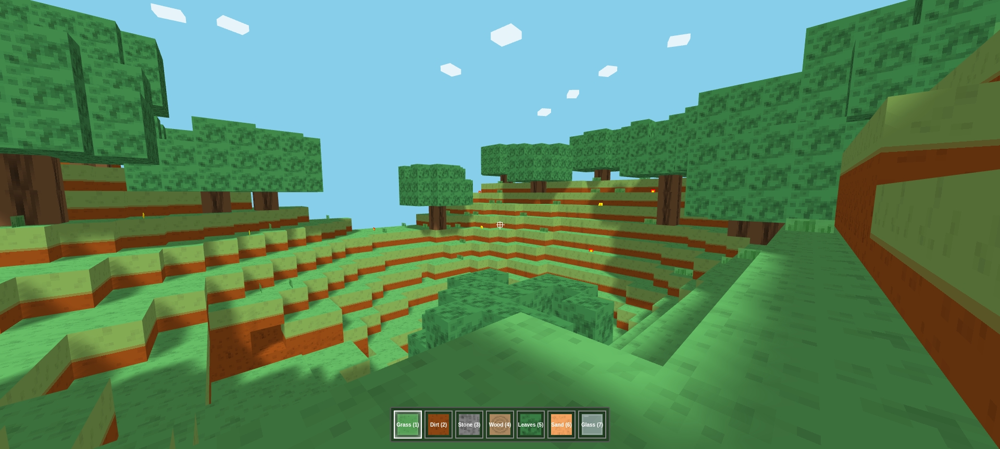

# Block Sandbox

A simple Minecraft-inspired block building sandbox built with Three.js.

## How to Run

1.  Ensure you have a web server capable of serving static files.
2.  Serve the `index.html` file from the project root.
3.  Open the served URL in your web browser.

*(Note: You need to add an image named `mc.jpg` to the root directory for the screenshot to display.)* 