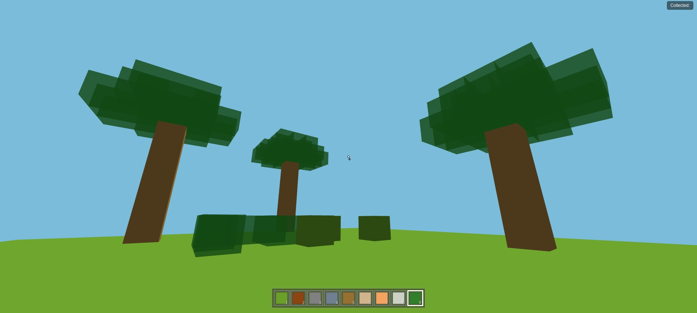

# Block Sandbox

A simple Minecraft-inspired block building sandbox built with Three.js.

## Features

*   Basic terrain generation (flat plane)
*   Player movement (WASD) and jumping (Space)
*   Mouse look controls (requires pointer lock)
*   Block placement (Right Click) and removal (Left Click)
*   Block type selection (1-5 keys)
*   Simple physics and collision detection
*   Basic lighting and shadows

## How to Run

1.  Ensure you have a web server capable of serving static files.
2.  Serve the `index.html` file from the project root.
3.  Open the served URL in your web browser.

*(Note: You need to add an image named `mc.jpg` to the root directory for the screenshot to display.)* 